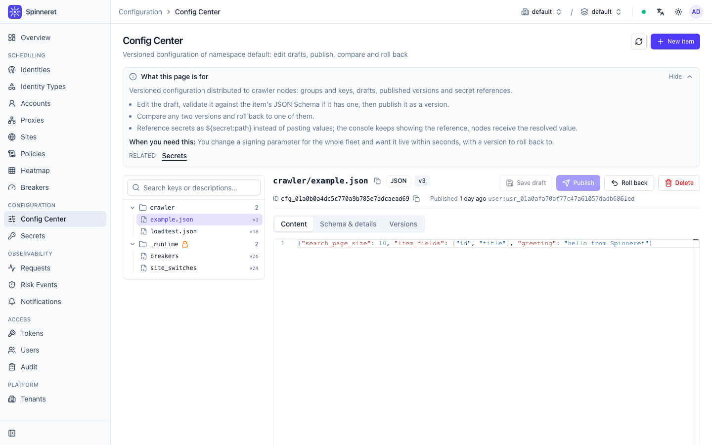

# Configuration center

**How a running fleet gets its settings: versioned config items, published from the console or the
API, delivered to nodes over a long poll that reaches them in tens of milliseconds, with secret
values referenced rather than pasted.**

[中文](../zh/09-config-center.md)

---

## Contents

- [The problem it solves](#the-problem-it-solves)
- [Items, groups and keys](#items-groups-and-keys)
- [Formats and validation](#formats-and-validation)
- [Drafts, versions, publish and rollback](#drafts-versions-publish-and-rollback)
- [Secret references](#secret-references)
- [The node protocol](#the-node-protocol)
- [Who sees what](#who-sees-what)
- [The `_runtime` group](#the-_runtime-group)
- [The console page](#the-console-page)
- [Limits, tuning and metrics](#limits-tuning-and-metrics)
- [Operating safely](#operating-safely)
- [Errors](#errors)
- [Next](#next)

---

## The problem it solves

A Spinneret node is configured with two things: a server URL and an API token. Everything else it
needs to do its job — which endpoints to call, what rate to run at, which parser variant to use,
which signing parameter is current — comes from the server at run time.

That is deliberate. If a setting lives in a node's environment file or container image, changing it
means a redeploy of every node, the fleet runs two versions of the setting for as long as the
rollout takes, and nobody can say afterwards what value was live at 03:00. The configuration center
replaces that with one place to edit, an immutable version per publish, an audit entry per change,
and a delivery path that reaches every watching node in well under a second.

What it is not: it is not the server's own configuration. `SPINNERET_*` variables configure the
Spinneret server process and are covered by [Configuration reference](./03-configuration.md). The
configuration center distributes *your* node configuration, and Spinneret never interprets its
content — to the server it is a validated blob of JSON, YAML or text.

---

## Items, groups and keys

A **config item** is addressed by three names:

```
<namespace> / <group> / <key>
```

| Part | Meaning | Rule |
| --- | --- | --- |
| namespace | The isolation unit the item belongs to. A node's token binds it to one namespace. | Set by the token; a request may name it explicitly but it must match. |
| group | A folder. Used for organisation and for restricting a token to part of the configuration. | `^[a-zA-Z0-9][a-zA-Z0-9_.-]{0,63}$`. Names starting with `_` are reserved for the system. |
| key | The item name inside the group. | `^[a-zA-Z0-9][a-zA-Z0-9_./-]{0,127}$`. Slashes are allowed, so a key may look like a path. |

The group/key pair is what nodes ask for, and it is stable across a delete and re-create. Internally
an item also has an ID of the form `cfg_…`, which the admin API uses; nodes never see it.

A workable layout:

```text
crawler/search.json        parameters of the search endpoint
crawler/detail.json        parameters of the detail endpoint
crawler/rate.yaml          per-site concurrency and pacing
partner-api/client.json    settings of the partner integration
_runtime/breakers          system-maintained, read-only
_runtime/site_switches     system-maintained, read-only
```

Use groups the way you would use token scopes, because that is what they are for: a node that only
reads `crawler/*` gets a token scoped `config:read:crawler*` and physically cannot read
`partner-api/*`.

---

## Formats and validation

Every item has one of three formats, fixed at creation:

| Format | Stored as | Validated on save and publish | JSON Schema allowed |
| --- | --- | --- | --- |
| `json` | UTF-8 text | must parse as JSON | yes |
| `yaml` | UTF-8 text | every document of the stream must parse as YAML | yes |
| `text` | UTF-8 text | nothing beyond the size and encoding checks | no |

Content must be valid UTF-8, must not contain NUL bytes and must not exceed **4 MiB**.

### JSON Schema

A `json` or `yaml` item may carry a **JSON Schema (draft 2020-12)** of up to 1 MiB. The server
compiles it and validates the content against it every time a draft is saved and every time a
version is published. For YAML, each document of the stream is converted to JSON and validated
separately; an empty stream counts as one `null` document.

External `$ref` targets are refused — a schema cannot make the server read a local file or reach the
network. Validation failures come back as `invalid_argument` listing up to 20 distinct instance
locations and messages, so the editor can point at the offending field.

A schema is the cheapest guard you have against a bad publish. Attaching one to an item that nodes
parse into a typed structure costs a few minutes and turns a fleet-wide crash into a rejected
publish.

```json
{
  "type": "object",
  "required": ["concurrency", "timeout_ms"],
  "properties": {
    "concurrency": { "type": "integer", "minimum": 1, "maximum": 64 },
    "timeout_ms":  { "type": "integer", "minimum": 100, "maximum": 30000 },
    "variant":     { "enum": ["a", "b"] }
  },
  "additionalProperties": false
}
```

---

## Drafts, versions, publish and rollback

Each item has exactly one mutable **draft** and a list of immutable **published versions**. Nodes
only ever see published versions.

```
edit  →  draft (validated, invisible to nodes)
      →  publish  →  version N (immutable, delivered to nodes)
      →  rollback →  version N+1 whose content is that of an older version
```

### Saving a draft

`SaveConfigDraft` stores content, and optionally a new schema or description. It requires
`config:write`. The draft is validated exactly like published content — syntax, schema, secret
reference *syntax* — but referenced secrets do not have to exist yet, so you can stage a config
change before the secret is created.

A draft whose content is byte-identical to the current published version is discarded rather than
stored; the console reports "The content equals the published version; the draft was cleared".

### Publishing

`PublishConfig` requires `config:publish`. It re-validates the draft inside the database
transaction, this time also checking that **every referenced secret, and every pinned secret
version, exists in the namespace**. A missing reference fails the publish with
`failed_precondition` listing the references that could not be found — the config is never published
in a state where a node would fail to resolve it.

On success the draft is cleared, a new version is written, and the item's `current_version` moves to
it.

`expected_version` gives you optimistic concurrency: set it to the version you were looking at and
the publish fails with `conflict` if someone else published in the meantime. Set it to `0` to skip
the check.

### Version numbering

Versions start at 1 and increase by one on every publish **and every rollback**. They never repeat
for a namespace/group/key. Deleting an item records its last version as a floor, so an item created
again under the same name continues above that floor rather than restarting at 1. This matters
because nodes identify content by group, key and version only: a repeated version number would let a
node believe it already holds content it has never seen.

### Rollback

`RollbackConfig` takes an old version number and republishes *its content* as a new version whose
`source_version` records where the content came from. History stays linear — nothing is rewritten or
removed, and the version history shows "Rollback of v7".

Two consequences worth knowing:

- The content is re-validated against the item's **current** schema. If the schema was tightened
  after v7 was published, rolling back to v7 can legitimately fail. Loosen or remove the schema
  first, or roll back to a version that satisfies it.
- The draft is **not** touched by a rollback. A rollback with an unrelated draft sitting on the item
  leaves that draft in place, ready to be published by the next person who presses Publish.

Rolling back to the version that is already current fails with `failed_precondition`.

### Deleting

`DeleteConfigItem` requires `config:publish` and removes the item and all of its versions
permanently. Nodes reading it afterwards get `not_found`; watchers are **not** woken by a deletion
and simply keep the last version they hold until their poll times out and they poll again. Deleting
an item that nodes depend on is therefore a slow, silent failure — prefer publishing a safe value.

### Who changed what

Every item records the actor that last saved the draft (`draft_updated_by`) and the actor that
published the current version (`published_by`), as `user:<id>` or `token:<id>`, with timestamps.
Each published version additionally keeps its own `published_by`, `published_at` and free-text
`comment`.

Independently of that, the audit log records `config.create`, `config.draft.save`, `config.publish`,
`config.rollback` and `config.delete`, plus a denied `config.read` entry when a node is refused a
referenced secret. **Contents are never written to the audit log.**

---

## Secret references

Config content may reference a secret from the [secret vault](./10-secrets.md) instead of embedding
its value:

```text
${secret:<path>}            the current version of the secret
${secret:<path>#<version>}  a pinned version
```

The path is relative to the item's namespace and must match
`^[a-z0-9][a-z0-9_./-]{0,255}$` with no empty, `.` or `..` segments. A pinned version is a positive
integer without leading zeros. At most **100 distinct references** may appear in one item.

There is no escape syntax: **every** `${secret:` sequence in the content must form a valid
reference, otherwise the save is rejected with `invalid_argument` naming the byte offset. If you
need the literal text, do not write it.

### How a node gets the value

| Reader | What it sees |
| --- | --- |
| Console and `ConfigAdminService` | the raw content, references shown verbatim, never resolved |
| A node through `ConfigService` | the content with every reference replaced by the secret value |

The substitution happens per request, on behalf of the calling principal:

1. The server collects the distinct references of the published version (they are scanned once when
   the version is first loaded, then cached with it).
2. For each reference it reads the secret **as the node**, with purpose `config:<group>/<key>`. The
   node's own `secret:read:<namespace>/<path glob>` scope decides whether that succeeds, and the
   read is written to the secret audit trail like any other.
3. For a `json` item the value is JSON-string escaped before substitution, so a secret containing a
   quote or a backslash cannot break the document. For `yaml` and `text` the raw value is inserted.

If the node's token does not cover one of the paths, the **whole request** fails with
`permission_denied` (reason `scope_missing` for a token) — never a partial document with a hole in
it — and the refusal is audited as `config.read` / `denied`. If a referenced secret has disappeared
since the publish, the request fails with `failed_precondition`.

### The `has_secret_refs` flag

Any delivered item whose published content contained references carries `has_secret_refs: true`.
Clients must not persist such content in plain text. Both SDKs honour this: the Go and Python config
watchers skip snapshotting an item flagged by the server, and remove any older snapshot of it. The
Python watcher can encrypt secret snapshots instead (`cache_secrets=True`, key derived from the API
token); both SDKs also accept a `treat_as_secret` / `TreatAsSecret` predicate for items that embed
sensitive values directly rather than referencing them.

```json
{
  "endpoint": "https://target.example/search",
  "api_key": "${secret:signing/api_key}",
  "legacy_key": "${secret:signing/api_key#3}"
}
```

---

## The node protocol

Three RPCs on `ConfigService`, all requiring `config:read` on the group of every item touched:

| RPC | Procedure | Behaviour |
| --- | --- | --- |
| `GetConfig` | `/spinneret.v1.ConfigService/GetConfig` | one item; `not_found` when it does not exist or was never published |
| `BatchGetConfig` | `/spinneret.v1.ConfigService/BatchGetConfig` | 1–200 items; unknown or unpublished ones land in `missing` instead of failing |
| `WatchConfig` | `/spinneret.v1.ConfigService/WatchConfig` | 1–200 items; long-polls for changes |

Transports, authentication and the JSON encoding are described in
[Node API reference](./13-node-api.md); everything below applies to all three.

A delivered `ConfigItem` carries `namespace`, `group`, `key`, `format`, `version`, `content`,
`updated_at` and `has_secret_refs`.

### The version token

`version` is the whole protocol state a node has to keep. It is a plain `int32` that increases on
every publish and rollback of that item and never repeats.

`WatchConfig` sends, per item, the version the node currently holds:

- `version: 0` means "I hold nothing" — the item is returned as soon as it has a published version.
- any other value means "I hold this" — the item is returned as soon as the published version
  **differs** from it.

The comparison is *differs*, not *is greater than*. That is what makes a rollback reach a node: a
rollback publishes a higher number, but so would any publish, and an item deleted and re-created is
also delivered with its new number.

### Long-poll semantics

```
POST /spinneret.v1.ConfigService/WatchConfig
{
  "items": [
    {"group": "crawler", "key": "search.json", "version": 12},
    {"group": "crawler", "key": "rate.yaml",   "version": 4}
  ],
  "timeout_ms": 30000
}
```

- If anything already differs, the call returns immediately with the changed items.
- Otherwise it blocks. `timeout_ms: 0` selects the server default of **30 000 ms**; the maximum
  accepted value is **60 000 ms**, and the server caps the wait at 60 s regardless. A shorter client
  deadline shortens the wait further.
- On timeout the response is an empty `items` list. That is the normal, expected answer, not an
  error. Poll again with the same versions.
- The response contains **only** the changed items. Items that did not change, items that were
  deleted and items that have never been published are omitted, and a deleted or unpublished item
  does not end the poll.

Two details that keep a multi-instance deployment honest:

- **A node is never moved backwards.** If a node arrives holding a version *newer* than the one this
  instance has cached — because it last talked to a peer that had already processed the publish, or
  because a bus event was lost — the instance re-reads the item from PostgreSQL before delivering
  anything. It will not hand the node an older version, and it will not answer instantly with the
  version the node already has.
- **Responses are bounded.** The combined content of one response is capped (32 MiB by default). A
  watch that exceeds it returns a subset and delivers the rest on the next poll;
  `BatchGetConfig` fails instead of truncating.

### How fast a change arrives

Publishing writes the version, then announces it on the event bus; every instance invalidates its
cached version for that key and wakes the watchers registered on it. A periodic resync (every 30 s
by default) re-reads the versions of watched items from PostgreSQL, so a lost bus event costs
latency, never correctness.

Measured on the project's load harness (`test/load/config_awareness.py`, 200 probe watchers on an
idle instance, 6 publishes, publisher and watchers in the same process so both timestamps share one
clock):

| Measure | Result |
| --- | --- |
| Watchers woken | 1,200 / 1,200 |
| End-to-end p99, measured from just before the publish RPC | **46.1 ms** |
| End-to-end maximum | 46.8 ms |
| p99 measured from the moment `PublishConfig` returned | 38.4 ms |

The design target was one second. Concurrency was measured separately
(`test/load/watch_config.js`): **~10,000 blocked `WatchConfig` calls on one instance**, zero
failures, 0.05 CPU cores and 504 MiB RSS. A blocked watcher issues no Redis traffic at all.

**Note.** Ten thousand nodes reconnecting in the same millisecond is a load-balancer problem before
it is a server problem. In the benchmark a burst of 10,000 connections overran the reverse proxy's
dial timeout while the server itself sat at 0.8 % CPU. Stagger node restarts, and see
[Performance and tuning](./17-performance.md).

### Writing a watch loop

The SDKs already implement the loop; use them if you can ([SDKs and examples](./14-sdks.md)).

```python
from spinneret import Client

with Client("https://spinneret.internal", "spn_…") as client:
    with client.config_watcher(["crawler/search.json"]) as watcher:
        item = watcher.get("crawler", "search.json")
        # ... the watcher long-polls in a background thread and keeps `item` current
```

```go
w, err := client.NewConfigWatcher(spinneret.WatcherOptions{
    Items:       []spinneret.ConfigKey{{Group: "crawler", Key: "search.json"}},
    SnapshotDir: "/var/lib/mynode/config",
    OnChange:    func(item *spinneret.ConfigItem) { reload(item.GetContent()) },
})
if err != nil {
    return err
}
if err := w.Start(ctx); err != nil {
    return err
}
defer w.Stop()
```

Both watchers do the same thing: an initial `BatchGetConfig`, then `WatchConfig` in a loop, applying
changes and invoking listeners. Both fall back to local snapshots when the server is unreachable at
start-up, so a node can boot during a control-plane outage with the configuration it last saw.

If you write the loop yourself, five rules:

1. Start from `version: 0` and always send back the version you last received.
2. An empty response is a timeout. Re-issue the call; do not treat it as an error and do not back
   off.
3. Back off on errors — one second growing to thirty is what the SDKs use — and jitter it.
4. Guard against a proxy that answers your long poll instantly: if a poll with no changes returns in
   under ~200 ms, wait before re-issuing, or a misconfigured intermediary turns your watch into a
   busy loop. The Go SDK enforces a 200 ms minimum poll interval; the Python watcher and any
   hand-written loop must add the guard themselves.
5. Set your client deadline above `timeout_ms`, not below it.

### Shutdown

When the server drains, in-flight `WatchConfig` long polls are cancelled deliberately while short
reads are allowed to finish. Nodes see a cancelled call, back off and reconnect to another instance.
This is expected during a rolling upgrade and is not an incident.

---

## Who sees what

There is no per-site, per-client or per-node targeting of a config item. The visibility rules are
exactly two:

1. **Namespace.** An item belongs to one namespace. A node's token is bound to one namespace and can
   read nothing outside it.
2. **Group.** A token scope may restrict which groups it can read, by glob.

| Scope | Grants | Argument |
| --- | --- | --- |
| `config:read` | `config:read` | optional group glob |
| `config:publish` | `config:read`, `config:write`, `config:publish` | optional group glob |

The glob language is deliberately small: `*` matches any run of characters (including `/`), `?`
matches one character, everything else is literal. `config:read:crawler*` matches `crawler`,
`crawler.v2` and `crawlers`; `config:read` without an argument matches every group, `_runtime`
included.

Console users get their permissions from their role in the namespace:

| Permission | Roles that hold it | What it allows |
| --- | --- | --- |
| `config:read` | viewer, operator, admin, owner | list items, read content, versions and diffs |
| `config:write` | operator, admin, owner | save drafts, change schema and description |
| `config:publish` | admin, owner | create-and-publish, publish, roll back, delete |

`config:publish` is also available as an **extra permission** on a role binding, which grants that
one right without promoting the user to admin. See
[Tenants, users and tokens](./11-access-control.md).

### Targeting a subset of the fleet

Because targeting is by group, that is how you build it. Give the canary nodes a different token and
a different group or key:

```text
crawler/search.json          read by tokens scoped config:read:crawler*
crawler-canary/search.json   read by the canary token, scoped config:read:crawler-canary*
```

or, when the nodes are otherwise identical, put the environment in the key
(`crawler/search.prod.json`, `crawler/search.canary.json`) and let each node's own settings choose
which key it watches. Both are explicit, both are visible in the console tree, and neither depends
on the server guessing who is asking.

---

## The `_runtime` group

Group names starting with `_` are reserved. One such group exists today: `_runtime`, which is
read-only, has no drafts, no versions to roll back and cannot be created or edited from the console.
It exposes live scheduling state through exactly the same read and watch protocol as ordinary items:

| Item | Format | Content |
| --- | --- | --- |
| `_runtime/breakers` | `json` | every site with its paused flag and its **non-closed** circuit breakers, keyed `<client>/<group>` |
| `_runtime/site_switches` | `json` | the pause switch of every site, with reason and timestamp |

```json
{
  "namespace": "prod",
  "version": 7,
  "sites": {
    "example-site": {
      "paused": false,
      "groups": {
        "web/search": {
          "state": "open",
          "open_until": "2026-09-17T10:02:00.000Z",
          "manual": false,
          "reason": "…"
        }
      }
    }
  }
}
```

The version of a `_runtime` item advances on every breaker transition or site pause, so a node can
`WatchConfig` on `_runtime/breakers` and learn within milliseconds that an endpoint group has been
broken, instead of discovering it on the next rejected `Acquire`.

**Note.** The `version` field *inside* the document is the internal counter, which starts at 0. The
version in the protocol envelope is that counter plus one, because `0` already means "holds nothing"
in a watch request. Compare protocol versions with protocol versions.

Reading `_runtime` needs `config:read` on the group `_runtime`. A token whose scope carries a glob
must match it — `config:read:_*` or an unrestricted `config:read` — so a token scoped
`config:read:crawler*` cannot see it.

---

## The console page

**Config Center**, at `/config`, under *Configuration* in the navigation. It acts on the namespace
selected in the scope switcher.



### Layout

A tree on the left, an item panel on the right.

The tree groups items by group and lists keys inside them, with a search box that matches keys and
descriptions. Badges mark an item that has an unpublished draft, and system groups are marked
read-only. `_runtime` appears in the tree like any other group when you may read it.

The panel has three tabs:

| Tab | Contents |
| --- | --- |
| **Content** | the editor, with live JSON validation, a size indicator against the 4 MiB limit, and the list of secret references found in the text |
| **Schema & details** | the JSON Schema, the description, the format, the item ID, and who published or drafted last |
| **Versions** | the version history and the comparison tools |

### Editing and publishing

The editor validates JSON in the browser as you type — position-accurate errors, "Valid JSON" when
it parses — and leaves YAML and schema validation to the server, which checks both on save and on
publish. Below the editor, the console lists every `${secret:…}` reference it found and flags
malformed ones (unterminated, bad path, bad version) before you ever call the server. **The console
never resolves a reference**; it always shows the literal text.

`Save draft` stores the draft. `Publish` opens a dialog showing a side-by-side diff of the published
version against the draft, a comment field, and the version number that will be created; unsaved
edits are saved as the draft first. `Roll back` lets you pick a version and previews
"Current v12 → v7"; its comment field only *suggests* "Roll back to v7" as a placeholder, so
leaving it untouched publishes the rollback with an empty comment — type one.

If someone else changes the item while you have it open, the panel warns you ("This item was changed
by someone else while you were editing. Saving overwrites their draft.") and offers to discard your
edits and reload. Navigating away with unsaved edits prompts first.

### History

The Versions tab lists every published version newest first, with its number, comment, publisher and
time, marks the current one, and labels rollbacks as "Rollback of v7". You can view any version's
content, compare any two versions, or compare a version with the draft, and roll back from the row.

### Live updates

Publishing emits a `config.published` event on the namespace channel, so other consoles watching the
same namespace see the change without a refresh. See
[Observability and alerting](./12-observability.md).

---

## Limits, tuning and metrics

| Limit | Value | Where it applies |
| --- | --- | --- |
| Content size | 4 MiB | per item version and per draft |
| JSON Schema size | 1 MiB | per item |
| Description | 1024 characters | per item |
| Publish comment | 1024 characters | per publish or rollback |
| Items per node call | 1–200 | `BatchGetConfig`, `WatchConfig` |
| Distinct secret references | 100 | per item content |
| Response size | 32 MiB | combined content of one node read |
| Group name | 1–64 characters | pattern above |
| Key | 1–128 characters | pattern above |
| List page size | 50 default, 500 maximum | admin list calls |

One server variable tunes the config center:

| Variable | Default | Meaning |
| --- | --- | --- |
| `SPINNERET_MAX_WATCHERS` | `20000` | `WatchConfig` calls that may be blocked at the same time **on one instance**. Beyond it new watches fail with `resource_exhausted` / `rate_limited` and a 1 s retry hint. |

The remaining knobs are compiled defaults, not environment variables: a 30 s default and 60 s
maximum long poll, a 30 s resync of watched versions, 100,000 cached item versions, a 64 MiB
published-content cache, the 32 MiB response budget and a 15 s per-operation database timeout.

Watch capacity is per instance, so the fleet limit is `SPINNERET_MAX_WATCHERS` × replicas. Sizing:
one node watching one set of items holds one blocked call. Ten thousand of them cost about half a
gigabyte of RSS and a twentieth of a core.

| Metric | Type | Meaning |
| --- | --- | --- |
| `spinneret_config_watchers` | gauge | `WatchConfig` calls currently blocked on this instance |

Watch it. A gauge that collapses to zero means your nodes stopped watching; a gauge pinned at
`SPINNERET_MAX_WATCHERS` means nodes are being turned away.

---

## Operating safely

### Before you publish

- **Attach a JSON Schema** to anything a node parses into a typed structure. It is the only
  validation that runs on the server's side of the boundary.
- **Read the diff.** The publish dialog shows it for a reason. A publish is instant and fleet-wide.
- **Write the comment.** It is the only free-text explanation the version history will ever have.
- **Use `expected_version`** when publishing from a script, so a concurrent console publish is
  rejected rather than silently overwritten.
- **Never paste a secret value.** Use `${secret:…}`. A value pasted into content is visible to every
  reader of the item, appears in every version forever, and lands in node snapshots on disk.

### Staged rollout

The server delivers a published version to everyone entitled to read it, immediately. Staging is
something you construct, and there are three honest ways to do it:

1. **Separate key or group per stage** (above). The canary nodes watch
   `crawler-canary/search.json`; you publish there, watch the outcome in
   [Observability and alerting](./12-observability.md), then publish the same content to
   `crawler/search.json`. Explicit, visible, and the only approach where a bad value provably cannot
   reach production nodes.
2. **A switch inside the content.** Ship both variants in one item with a selector the node
   evaluates (`"variant": "b"`, or a percentage the node compares against a hash of its own name).
   One item to manage, but every node parses the new content, so a document that breaks the parser
   breaks everything.
3. **Publish during a quiet window** and watch the success rate. Acceptable for low-risk items,
   never for the one that controls request construction.

Whichever you use, know your rollback path *before* you publish, and know that rolling back is
itself a publish: it takes the same tens of milliseconds to reach the fleet.

### When a bad config is published

1. **Roll back first, diagnose second.** Open the item, Versions tab, pick the last known-good
   version, `Roll back`. It republishes that content as a new version and every watching node has it
   within a second. Do not edit the draft and re-publish under pressure — the rollback path is one
   click and cannot introduce a new typo.
2. **Check that the rollback validated.** If the schema was tightened after the good version was
   published, the rollback is rejected. Remove or loosen the schema, roll back, then restore the
   schema in a separate change.
3. **Confirm the nodes moved.** `spinneret_config_watchers` should be steady; node logs should show
   the new version. A node that is not watching — one that called `GetConfig` once at start-up —
   will not pick it up. That is a reason to prefer watches over one-shot reads.
4. **Check for nodes still on the bad version.** Nodes that were disconnected during the incident
   resume from the version they hold; because the comparison is "differs", they receive the
   rolled-back content on their first successful poll.
5. **Afterwards**, add the schema rule that would have rejected the bad content, and record the
   incident against the audit entries (`config.publish`, actor, timestamp).

### Things that bite

| Situation | What happens | What to do |
| --- | --- | --- |
| Item deleted while nodes read it | Nodes get `not_found`; watchers are never woken and keep serving the last content they hold | Publish a safe value instead of deleting; delete only after the readers are gone |
| Secret deleted after publish | Node reads fail with `failed_precondition` | Treat referenced secrets as load-bearing; rotate by adding a version, not by deleting |
| Token lacks the secret glob | The whole config read fails with `permission_denied` / `scope_missing`, audited as `config.read` / `denied` | Grant `secret:read:<namespace>/<path glob>` covering every path the item references |
| Node holds a newer version than an instance | The instance re-reads from PostgreSQL before answering | Nothing — this is handled; it costs one query |
| Watch gauge at the ceiling | New watches get `resource_exhausted` / `rate_limited` | Raise `SPINNERET_MAX_WATCHERS` or add a replica |
| One-shot `GetConfig` at start-up only | The node never sees a change | Use a watcher |

---

## Errors

| Reason | Code | When |
| --- | --- | --- |
| `not_found` | not found | the item does not exist, was never published, or is invisible to the caller |
| `invalid_argument` | invalid argument | malformed group or key, bad format, content that fails syntax or schema validation, malformed secret reference, bad page token, more than 200 items, more than 100 distinct references |
| `permission_denied` | permission denied | a console user lacks `config:read` / `config:write` / `config:publish` on the group |
| `scope_missing` | permission denied | a token's scopes do not cover the group, or do not cover a referenced secret path |
| `failed_precondition` | failed precondition | no draft to publish, rolling back to the current version, a referenced secret or pinned version that does not exist, secret resolution unavailable |
| `conflict` | aborted | `expected_version` did not match the current version |
| `rate_limited` | resource exhausted | `SPINNERET_MAX_WATCHERS` reached on this instance; retry after ~1 s |

The full reason table for every service is in [Troubleshooting](./18-troubleshooting.md).

---

## Next

- [Secret vault](./10-secrets.md) — what `${secret:…}` resolves against, and how to rotate a value
  without touching the config items that reference it.
- [Node API reference](./13-node-api.md) — the exact request and response JSON of `GetConfig`,
  `BatchGetConfig` and `WatchConfig`, transports and retry rules.
- [SDKs and examples](./14-sdks.md) — the managed watchers, snapshots and the example node.
- [Tenants, users and tokens](./11-access-control.md) — group globs, roles and the extra
  `config:publish` permission.
- [Observability and alerting](./12-observability.md) — watching the effect of a publish, and the
  `spinneret_config_watchers` metric.
- [Performance and tuning](./17-performance.md) — the watcher benchmark, the load-balancer hazard
  and the tuning levers in the order they pay.
